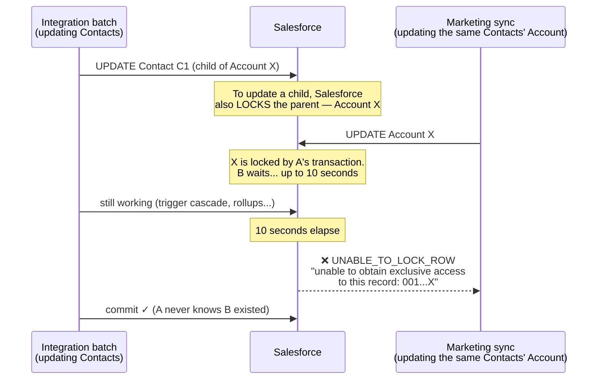
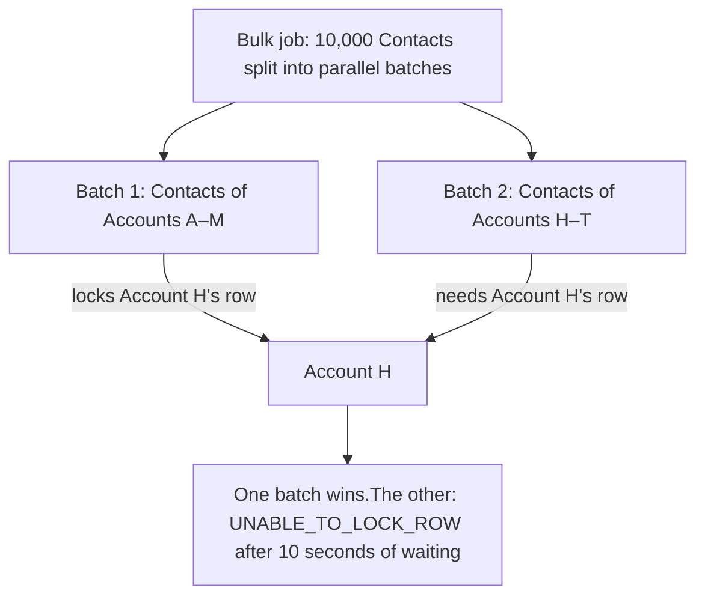
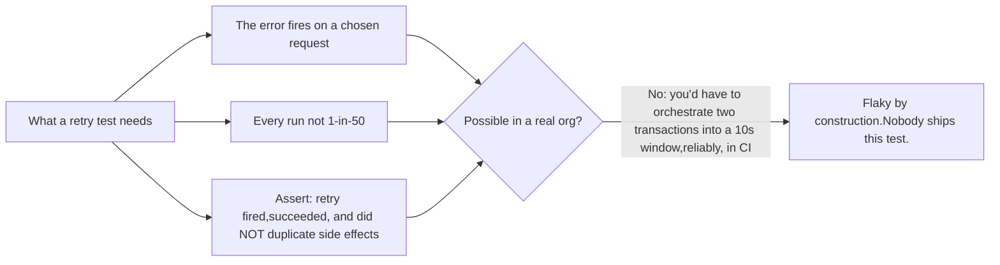
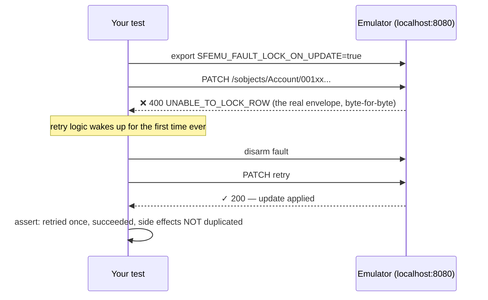

In [my last post](/blog/why-is-there-no-localstack-for-salesforce) I told the story of my first `UNABLE_TO_LOCK_ROW` page. It talked about the forum thread, the error that obfuscated instead of providing clarity and the untested/absent retry logic. This post is the page I wish I had landed on that night. What the error actually is, why it's confusing on purpose (well, not on purpose, but it might as well be), where it comes from, why the standard fixes are all coin flips, and how to actually test your way out of it.

## What the error actually is

If you didn't already know this, [Salesforce is multi-tenant](https://architect.salesforce.com/docs/architect/fundamentals/guide/platform-multitenant-architecture#:~:text=The%20Salesforce%20Platform%E2%80%99s%20software,Multitenant). It means your org shares infrastructure with thousands of others, the way apartments share a building. That's why the platform has to be defensive about resources: limits and timeouts everywhere, because one tenant's process can't be allowed to degrade the building.

And like any database that takes writes, it locks a record while a transaction is updating it, so that two simultaneous edits can't half-merge into corrupted data. Locking just the one row (instead of a whole table) is what lets everyone else keep working. The only process that waits is one that wants the exact same record.

Put those together and `UNABLE_TO_LOCK_ROW` starts to make sense: A transaction updates a record and holds the lock. Another transaction wants the same row and waits. If it's still waiting after **ten seconds**, Salesforce refuses to let it wait longer and throws:

```
System.DmlException: Update failed. First exception on row 0 with id
001B000001ABCdEIAX; first error: UNABLE_TO_LOCK_ROW, unable to obtain
exclusive access to this record or 1 records: 001B000001ABCdEIAX
```

That's the whole mechanism: a collision plus a timer. Two transactions wanted the same row inside the same ten-second window; one won, one got this error. Here's the collision as a picture:



Three things to consider:

**The loser gets the error; the winner never knows.** This is why the failure appears out of nowhere with no deployment on your side. Nothing changed in your system. Another process on the tenant changed its schedule, or its data volume grew and your job started erroring out. That's why I checked the CD page for our product that night to check if a newly deployed code might have caused this error.

**The parent-lock trap.** The ID in the error above starts with `001`, so it's an Account. Now suppose the job that failed was updating _Contacts_. What? That's because [**updating a child record also locks its parent.**](https://help.salesforce.com/s/articleView?id=000387767&type=1#:~:text=When%20an%20After,the%20locking%20error.) Two jobs touching completely different Contacts under the same Account will collide on the Account. Some org setups make the collision more likely. If the relationship is master-detail ie Salesforce's strict parent-child link, the parent lock is taken every time, no exceptions. And if the parent has rollup fields (a count of its Contacts, a sum of its Opportunities etc), then every child edit doesn't just lock the parent, it _writes_ to it, thus holding the lock longer.

And understandably, the error names the record that was locked, not the record your job was updating. Your Contact job fails, the error shows an Account ID, and you go off debugging Accounts.

**The ten-second window is why it's rare and unkillable at the same time.** Most days, the winning transaction finishes in 9.8 seconds and nobody ever knows a race happened. The failure only surfaces when the winner runs long. Could be due to a heavy trigger cascade, a slow rollup, a big batch, callout latency and dozen other reasons.

## Where the collisions actually come from

After enough incidents you start recognizing the repeat offenders:

**Parallel Bulk API batches that share parents.** The Bulk API splits your job into batches and runs them in parallel. If batch 1 and batch 2 both contain Contacts belonging to Account H, they will both try to lock Account H:



Same job, same code, different record ordering per run but some runs collide. **The failure here is a property of the schedule.**

**Rollup packages.** Tools like DLRS and Rollup Helper exist to write parent fields whenever children change. That's their job description and it means every child edit becomes a parent lock. Installing one can turn a quiet org into a lock factory overnight, which is why "did we install anything recently?" is a better first question than "did we deploy anything recently?" I had that on a sticky note for a very long time!

**Two systems, one schedule.** The marketing platform syncs Leads hourly. Your integration processes the same Leads on its own timer. Most hours they miss each other. Some hours they don't.

**Parallel Apex tests.** Salesforce runs tests in parallel by default; tests touching shared setup records collide with each other. If your _test runs_ intermittently throw lock errors, this is usually why!

## The standard advice, and what it actually buys you

Every thread recommends some mix of: reduce the batch size, sort records by parent before batching, serialize the jobs, add `FOR UPDATE` to your SOQL, add retry logic. None of these is wrong. All of these share one property: **they lower the probability of collision. It does not eliminate it, and none can be verified before shipping.**

Smaller batches mean fewer records per lock window (until data volume grows back that is). Sorting by parent keeps one parent's children in one batch (until a second system enters the race). Serializing kills the parallelism you needed. `FOR UPDATE` trades the error for explicit waiting, which has its own timeout. And retry logic, the actually-correct answer, has a special problem of its own: **you will ship it without ever having seen it run.**

Think about what testing the retry requires. You need the error to fire on a request you chose deterministically:



People do try. The usual attempt is spawning two async jobs at the same record and hoping they interleave inside the window. Sometimes it works. Which is worse than never working because now your test suite itself has a timing-dependent failure, and the first thing a team does with a flaky test is delete it.

So the retry ships untested. It waits in production for the next collision, and you find out whether it works from the error logs (or from the customer who got charged twice, because the retry fired on a request whose side effects had already half-happened)

The bug isn't "the retry didn't fire.", it's "the retry fired and _duplicated something_": a second Task, a second email, a second charge. Retry correctness is really an **idempotency** question, and idempotency can only be tested against something that actually executes your side effects (But let's keep idempotency for some other time)

## Testing it for real

This is the part that didn't exist when I got my first lock page, and it's the reason I built [Fidelic](https://www.fidelic.dev): a Salesforce emulator in a Docker container that loads your org's schema, runs your Apex triggers, and, drumrolls please: **produces this error on command.**



The test:

```bash
# start the emulator with your org's code
docker run -p 8080:8080 -v ./mdapi:/mdapi fidelic/emulator --apex-src /mdapi

# arm the fault: the next update returns UNABLE_TO_LOCK_ROW
export SFEMU_FAULT_LOCK_ON_UPDATE=true

# run your integration's update path against localhost
./run-my-sync.sh          # → gets the 400, real envelope

# disarm; the retry should now succeed
unset SFEMU_FAULT_LOCK_ON_UPDATE
# assert in your test:
#   1. the retry fired exactly once
#   2. the update landed (GET the record, check the field)
#   3. NOTHING duplicated — one Task, one email record, one log row
```

Why an emulator, and not just a mocked 400 in your HTTP client? Three reasons:

**A mock tests your HTTP client. The emulator tests your integration.** The fault fires in front of a real trigger pipeline on a real record. When your retry re-sends the request, real triggers fire again and that's when the double-fire bug shows itself. Idempotency gets _tested_, not assumed. A hand-rolled mock can't give you that, because there's nothing behind it to duplicate.

**Determinism is the feature.** The real org's lock is a race while the emulator abstracts it to a switch. Same error envelope, same code path in your integration, zero timing.

**The faults stack.** Real incidents don't arrive one at a time! Salesforce gets slow, _then_ the lock errors start, _then_ you're suddenly near the API limit and the stars align perfectly. Because each failure here is a switch, you can flip them together: add five seconds of latency, arm the lock fault, cap the rate limit and run your whole suite against a Salesforce having its worst day. You can do this on every commit and against an org that resets in milliseconds.

## The checklist

Your retry logic is actually tested when you can check all four boxes:

- The error fires on the request you chose, every run
- The retry executes and succeeds
- Nothing duplicated: no second Task, email, or charge
- It runs green in CI, on every commit, with no timing in it

If you're checking those boxes some other way, write it up! I want to read it. And if you can't check them at all today, I'd point to the platform's shape I talked about in [the last post](/blog/why-is-there-no-localstack-for-salesforce). It's why Fidelic exists.

[fidelic.dev](https://www.fidelic.dev)'s early access is open. And the collection continues: tell me the failure you've never been able to rehearse.
